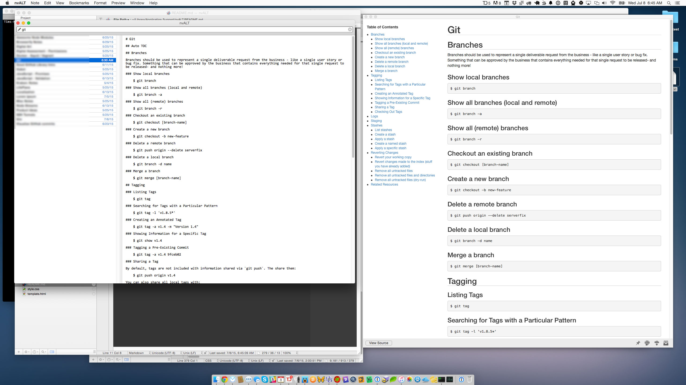

## About

An nvALT template capable of automatically generating TOCs in preview mode based on a document's headings (h1, h2) etc...

## Installation

```
$ cd ~/Library/Application\ Support/nvALT
$ git clone https://github.com/tkambler/nvalt-template .
$ npm install
$ grunt
```

## Screenshot


